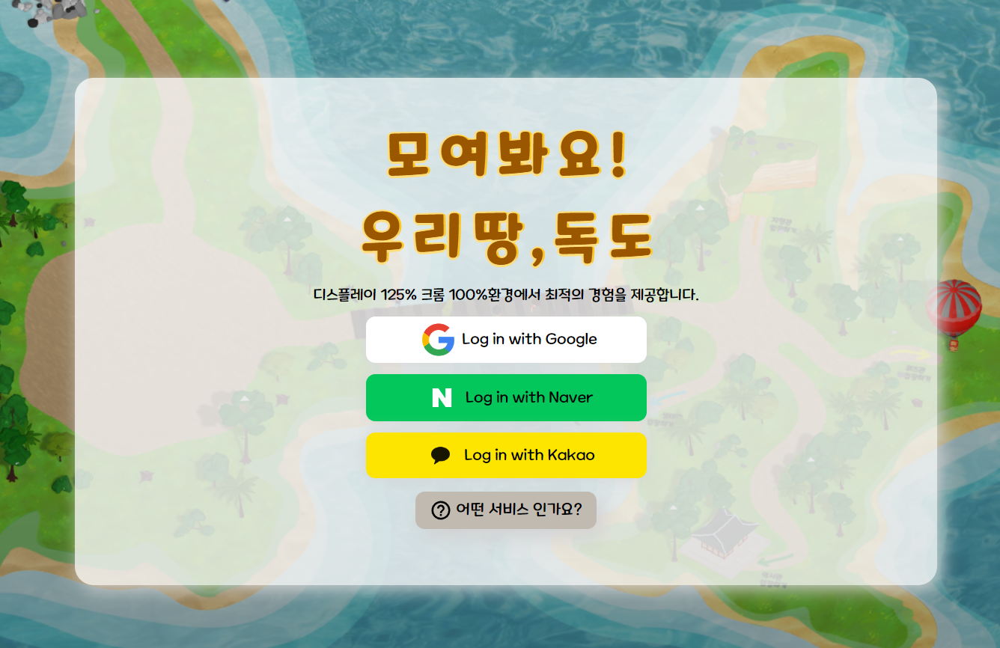
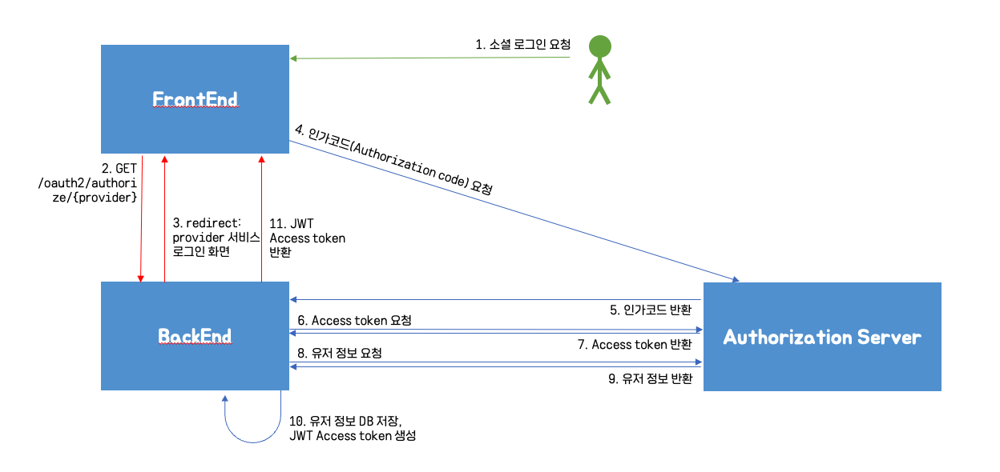
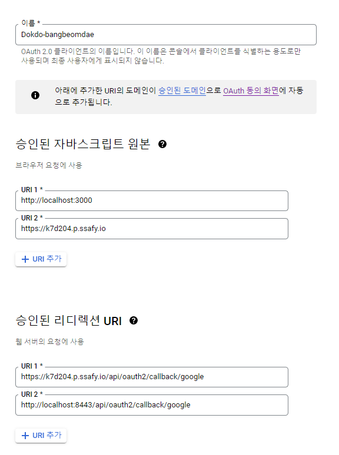
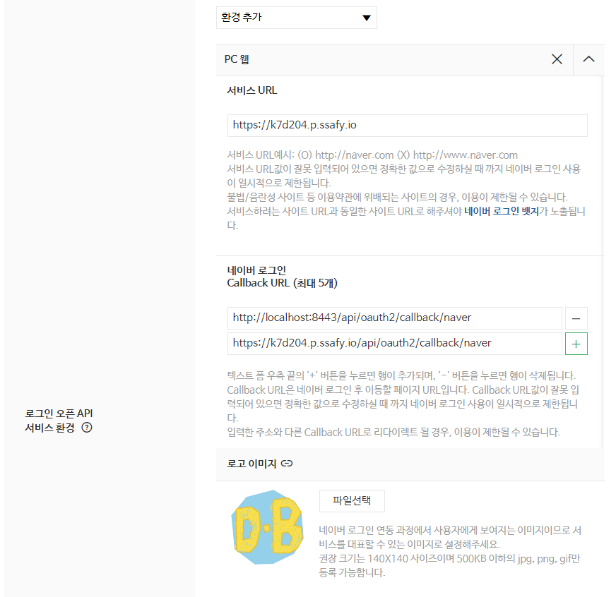
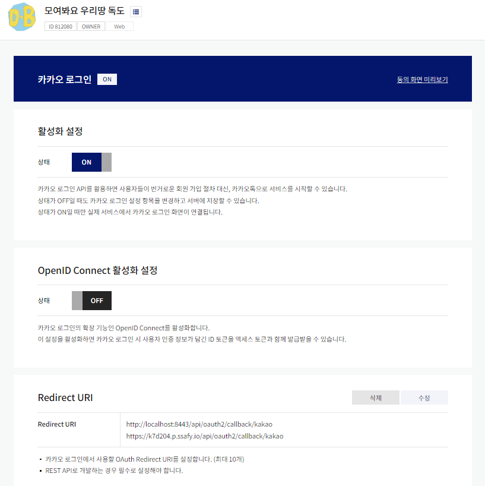
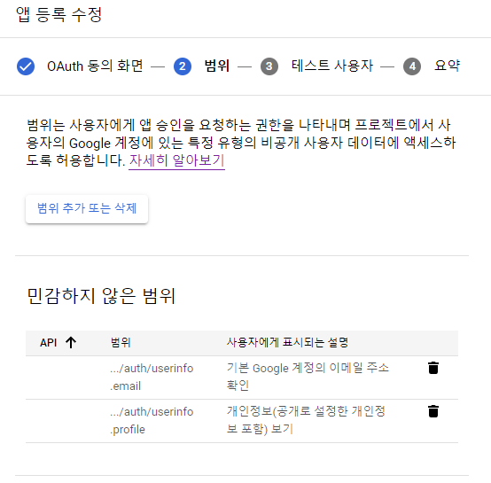
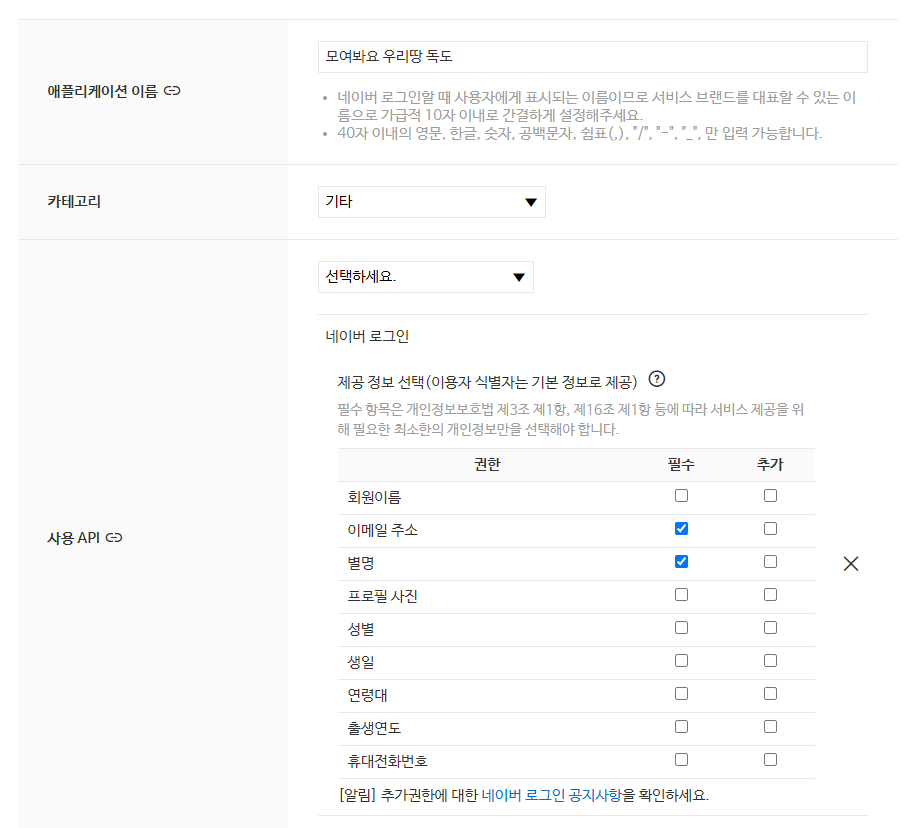
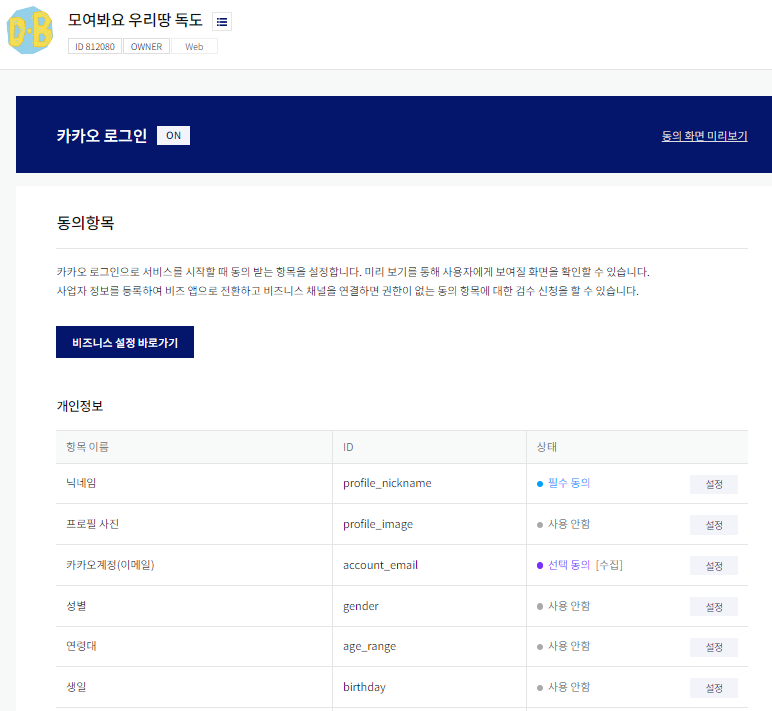

# ReadMe.md

## 목차

- [1. **팀원별 담당 역할**](#2-팀원별-담당-역할)
- [2. **프로젝트 설계**](#3-프로젝트-설계)
- [3. **기술 스텍**](#4-기술-스텍)
  - [[BackEnd]](#backend)
  - [[Infra]](#infra)

## 1. 팀원별 담당 역할

- 김성령 (뱃지, 도감 API 및 Infra)
- 김효선 (소셜 로그인 및 User, 게시판 API)
- 최영진 (뱃지, 도감 API 및 Infra)

## 2. **프로젝트 설계**

## 3. **기술 스텍**

### [BackEnd]

BE : Java8 / SpringBoot / MongoDB(6.0.2) / MySQL (8.0.31 for Linux)/ JPA/ OAuth 2.0

1. NoSQL (MongoDB) // RDBMS (MySQL)

   프로젝트를 계획하면서 JOIN할 필요 없는 단순한 읽고 쓰기 작업이 많다는 것을 깨닫고 Document 기반 NoSQL인 MongoDB를 사용했다.

   MongoDB를 사용함으로써 기존 RDBMS 보다 Read/Write를 빠르게 처리할 수 있었고, 데이터가 JSON 구조로 되어있어 프론트에서도 데이터 구조를 쉽게 이해할 수 있었다.

   MySQL ERD

   

   MongoDB 콜렉션

   

2. OAuth 2.0, JWT (소셜 로그인)
   

   Oauth를 통해 사용자에게 특별한 정보 요구 없이 권한을 부여하고 권한을 가진 사용자의 접근만을 허용하여 보안적으로 더 안전한 서비스를 유지하기 위해 사용했다. 또한 access token에 JWT를 사용하여 서버와 클라이언트 사이의 정보 교환을 더 안전하게 만들었다.

   구글, 네이버, 카카오 소셜 로그인 서비스를 사용하였다.

   **구조**
   

   **redirect url**

   - 구글

   

   - 네이버

   

   - 카카오

   

   **사용자 정보 수집 항목**

   - 구글

   

   - 네이버

   

   - 카카오

   

### [Infra]

Infra : Docker / EC2 / Nginx / Jenkins
