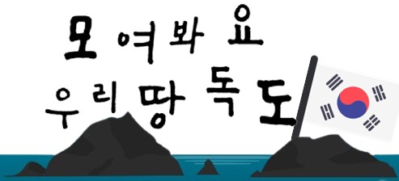

# ReadMe.md

## 목차

- [1. **프로젝트 개요**](#1-프로젝트-개요)
  - [1 - 1. 프로젝트 명](#1---1-프로젝트-명)
  - [1 - 2. 주제](#1---2-주제)
  - [1 - 3. 포팅 메뉴얼](#1---3-포팅-메뉴얼)
- [2. **팀원별 담당 역할**](#2-팀원별-담당-역할)
- [3. **프로젝트 설계**](#3-프로젝트-설계)
- [4. **기술 스텍**](#4-기술-스텍)
  - [[FrontEnd]](#frontend)
  - [[BackEnd]](#backend)
  - [[Infra]](#infra)
- [5. **프로젝트 진행 계획**](#5-프로젝트-진행-계획)
- [6. **서비스 화면**](#6-서비스-화면)
  - [6-1 로그인 화면](#6-1-로그인-화면)
  - [6-2 튜토리얼 및 지도화면](#6-2-튜토리얼-및-지도화면)
  - [6-3 캐릭터 변경](#6-3-캐릭터-변경)
  - [6-4 지형관](#6-4-지형관)
  - [6-7 역사관](#6-7-역사관)
  - [6-8 생태관](#6-8-생태관)
  - [6-9 OX, 그림찾기 게임](#6-9-OX,-그림찾기-게임)
  - [6-10 게시판](#6-10-게시판)
  - [6-11 마이페이지](#6-11-마이페이지)
  - [6-12 캐릭터 설정](#6-12-캐릭터-설정)
  - [6-13 상호작용](#6-13-상호작용)
- [7. **교보재**](#7-교보재)
- [8. **협업 툴**](#8-협업-툴)
- [9. **참고 자료**](#9-참고-자료)

## 1. **프로젝트 개요**

### 1 - 1. 프로젝트 명

모여봐요! 우리땅, 독도

### 1 - 2. 주제

Three.js를 활용한 게임을 만들어 독도를 홍보하고, 사용자가 독도에 대해 자세하게 알 수 있도록 한다.

### 1 - 3. 포팅 메뉴얼

[포팅 메뉴얼 바로가기](https://lab.ssafy.com/s07-final/S07P31D204/-/blob/master/exec/README.md)

## 2. 팀원별 담당 역할

- BE : 김성령( 뱃지, 도감 API 및 Infra), 김효선(소셜 로그인 및 User, 게시판 API), 최영진(뱃지, 도감 API 및 Infra)
- FE : 박소정(Three.js 및 Adobe Illustrator 메인 화면 구성, 팝업 컴포넌트 구성, FPS 개선), 임채현(소셜, 팝업 컴포넌트 구성, 마이페이지, 도감, 뱃지)

## 3. **프로젝트 설계**

## 4. **기술 스텍**

### [FrontEnd]

FE : React / Three.js / Javascript / Adobe Illustrator

### [BackEnd]

BE : Java8 / SpringBoot / MongoDB(6.0.2) / MySQL (8.0.31 for Linux)/ JPA/ OAuth 2.0

1. NoSQL (MongoDB) // RDBMS (MySQL)

   프로젝트를 계획하면서 JOIN할 필요 없는 단순한 읽고 쓰기 작업이 많다는 것을 깨닫고 Document 기반 NoSQL인 MongoDB를 사용했다.

   MongoDB를 사용함으로써 기존 RDBMS 보다 Read/Write를 빠르게 처리할 수 있었고, 데이터가 JSON 구조로 되어있어 프론트에서도 데이터 구조를 쉽게 이해할 수 있었다.

   MySQL ERD

   

   MongoDB 콜렉션

   

2. OAuth 2.0, JWT (소셜 로그인)
   

   Oauth를 통해 사용자에게 특별한 정보 요구 없이 권한을 부여하고 권한을 가진 사용자의 접근만을 허용하여 보안적으로 더 안전한 서비스를 유지하기 위해 사용했다. 또한 access token으로 JWT를 사용하여 서버와 클라이언트 사이의 정보 교환을 더 안전하게 만들었다.

   구글, 네이버, 카카오 소셜 로그인 서비스를 사용하였다.

   **redirect url**

   - 구글

   

   - 네이버

   

   - 카카오

   

   **사용자 정보 수집 항목**

   - 구글

   

   - 네이버

   

   - 카카오

   

### [Infra]

Infra : Docker / EC2 / Nginx / Jenkins

## 5. **프로젝트 진행 계획**

- 1 ~ 2 주차 : 프로젝트 기획 및 설계
- 3 ~ 5 주차 : 프로젝트 개발
- 6주차 : 프로젝트 마무리 및 UCC , 발표 준비

## 6. 서비스 화면

### 6-1 로그인 화면

### 6-2 튜토리얼 및 지도화면

### 6-3 캐릭터 변경

### 6-4 지형관

### 6-7 역사관

### 6-8 생태관

### 6-9 OX, 그림찾기 게임

### 6-10 게시판

### 6-11 마이페이지

### 6-12 캐릭터 설정

### 6-13 상호작용

## 7. 교보재

- \***\*자바 ORM 표준 JPA 프로그래밍 - 김영한\*\***
- \***\*three.js로 시작하는 3D 인터랙티브 웹 - 1분코딩\*\***
- **land 1 Low-poly 3D model - 3gtrader**
- **Quirky Series - Ultimate Pack Low-poly 3D model - 3gtrader**

## 8. **협업 툴**

- Notion
- Jira
- Mattermost

## 9. **참고 자료**

[three.js](https://threejs.org/docs/index.html#manual/en/introduction/Creating-a-scene)

[Spring Data MongoDB - Reference Documentation](https://docs.spring.io/spring-data/mongodb/docs/current/reference/html/#query-by-example)
